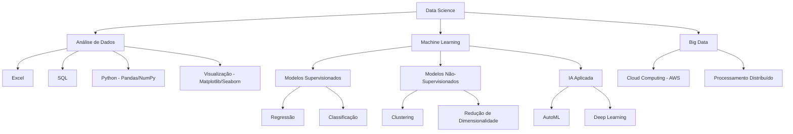

# DNC_DataScience

Repositório do curso de Data Science da DNC, contendo materiais, exercícios e projetos desenvolvidos durante o programa.

## 📚 Estrutura do Curso

O curso está organizado em 7 módulos principais, cada um focando em diferentes aspectos da ciência de dados:

### Matéria 1: Introdução à Análise de Dados
- **Introdução a Dados** (2h): Conceitos fundamentais, estrutura e qualidade de dados
- **Base de Dados** (4h): Fundamentos de bancos de dados e estruturação de dados
- **Excel Intermediário** (8h): Funções avançadas, fórmulas, tabelas dinâmicas e visualizações
- **Desafio 1** (3h): Aplicação dos conhecimentos em problemas reais

### Matéria 2: Excel
- **Carreira** (2h): Perspectivas profissionais em análise de dados
- **Excel Intermediário** (8h): Funções avançadas e análise de dados
- **Desafio 2** (3h): Projeto prático com Excel

### Matéria 3: SQL para Análise de Dados
- **SQL para Análise de Dados** (8h): Consultas, junções e análises
- **Desafio 3** (3h): Projeto prático de análise com SQL

### Matéria 4: Análise de Dados em Python
- **Introdução ao Python** (9h): Configuração do ambiente, estruturação de código, manipulação de listas e variáveis compostas
- **Análise de Dados com Python** (6h): Uso avançado de Pandas, NumPy, Matplotlib e Seaborn
- **Estatística Descritiva** (5h): Organização, resumo e análise exploratória de dados
- **Estatística Inferencial** (8h): Amostragem, distribuições de probabilidade, intervalos de confiança e testes de hipóteses
- **IA para análise de Dados** (2h): Utilização de Python e SQL para acelerar e automatizar análises
- **Desafio 4** (3h): Projeto de análise de dados com Python

### Matéria 5: Extração e Tratamento em Python
- **Data Cleaning e Wrangling** (8h): Coleta, limpeza e integração de dados de múltiplas fontes
- **Introdução a ML** (2h): Fundamentos de aprendizado supervisionado e não supervisionado
- **Desafio 5** (3h): Projeto de tratamento de dados reais

### Matéria 6: Regressão e Classificação
- **Regressão** (8h): Implementação e avaliação de diferentes tipos de regressão
- **Classificação** (8h): Técnicas de classificação desde a coleta até a implementação
- **IA para ciência de Dados** (2h): IA para resolver problemas relacionados a modelos avançados
- **Desafio 6** (3h): Implementação de modelos de classificação e regressão

### Matéria 7: Modelos de Clusterização
- **Clustering** (7h): Técnicas de agrupamento não supervisionado
- **Big Data** (5h): Conceitos e ferramentas para grandes volumes de dados
- **Modelos com IA e Cloud** (6h): Implementação e monitoramento de modelos de ML utilizando AWS
- **Desafio 7** (3h): Projeto final de clusterização

## 🔄 Atualização da Matriz Curricular


### ✨ Módulos Novos

1. **Introdução a Dados** (2h)
   - Conceitos fundamentais e estrutura de dados
   - Qualidade de dados e ferramentas essenciais
   - Rotina dos profissionais de dados

2. **Estatística Descritiva** (5h)
   - Organização e resumo de dados
   - Análise exploratória com medidas estatísticas
   - Técnicas de visualização de dados

3. **Estatística Inferencial** (8h)
   - Seleção de amostras e distribuições de probabilidade
   - Intervalos de confiança e testes de hipóteses
   - Análise de relações entre variáveis

4. **IA para Análise de Dados** (2h)
   - Automação de análises com Python e SQL
   - Técnicas de IA aplicadas à análise de dados

5. **Introdução a ML** (2h)
   - Fundamentos de aprendizado supervisionado e não supervisionado
   - Preparação de dados para machine learning

6. **IA para Ciência de Dados** (2h)
   - Aplicações de IA para modelos avançados
   - Otimização de regressão e classificação com IA

7. **Modelos com IA e Cloud** (6h)
   - Implementação de modelos de ML na AWS
   - Desenvolvimento de pipelines escaláveis
   - Integração de IA e computação em nuvem

### 🔄 Módulos Regravados e Aprimorados

1. **Introdução a Python** (9h)
   - Configuração do ambiente de desenvolvimento
   - Estruturação de código e boas práticas
   - Manipulação de listas e variáveis compostas
   - Projetos práticos com Pandas e NumPy

2. **Análise de Dados com Python** (6h)
   - Uso avançado de Pandas e NumPy
   - Visualização com Matplotlib e Seaborn
   - Identificação de padrões em dados

3. **Data Cleaning e Wrangling** (8h)
   - Coleta e integração de dados de múltiplas fontes
   - Técnicas de limpeza e garantia de qualidade
   - Engenharia de features para modelagem preditiva
   - Otimização do fluxo de trabalho com grandes volumes

4. **Classificação** (8h)
   - Coleta e preparação de dados para classificação
   - Seleção, treinamento e ajuste de modelos
   - Validação e implementação de classificadores

5. **Regressão** (8h)
   - Regressão linear simples e múltipla
   - Otimização de hiperparâmetros
   - Avaliação e implementação de modelos de regressão

## 🌟 Por que essa atualização é importante?

<div align="center">

</div>

### 1️⃣ Conteúdo alinhado com o mercado
- Módulos completamente revisados para refletir as tendências e exigências das empresas
- Foco em habilidades práticas valorizadas pelos empregadores

### 2️⃣ Carga horária otimizada
- Maior profundidade em Python, IA, Estatística e Machine Learning
- Distribuição de tempo baseada na relevância dos tópicos para o mercado atual

### 3️⃣ Aprendizado prático e direcionado
- Cases reais de empresas para aplicação imediata dos conhecimentos
- Materiais didáticos atualizados com as mais recentes ferramentas e técnicas
- Projetos que simulam desafios reais do dia a dia de um cientista de dados

## 🛠️ Ferramentas e Tecnologias



## 📊 Projetos e Desafios

O curso inclui 7 desafios práticos que aplicam os conceitos aprendidos em cada módulo, permitindo aos alunos consolidar conhecimentos e desenvolver projetos para o portfólio. Abaixo, detalhamos cada um dos desafios previstos no curso:

### 🔍 Desafio 1: Preveja os resultados de um e-commerce utilizando o Power BI

**Status**: Concluído ✅

**Objetivo**: Criar um dashboard no Power BI para analisar os resultados de um e-commerce e prever tendências futuras.

**Descrição**: Neste desafio, os alunos devem desenvolver um dashboard interativo no Power BI para analisar dados de vendas de um e-commerce. O arquivo RID190616_Desafio01.pbix contém a solução desenvolvida, que inclui:

1) **Análise de vendas por período**:
   - Visualização de tendências temporais
   - Comparação de desempenho entre diferentes períodos

2) **Segmentação de clientes**:
   - Análise por região geográfica
   - Categorização por comportamento de compra

3) **Performance de produtos**:
   - Identificação dos produtos mais vendidos
   - Análise de margens de lucro por categoria

4) **Indicadores de desempenho (KPIs)**:
   - Taxa de conversão
   - Ticket médio
   - Faturamento total

5) **Previsões futuras**:
   - Utilização de ferramentas de análise preditiva do Power BI
   - Projeção de vendas para os próximos períodos

**Habilidades desenvolvidas**:
- Importação e tratamento de dados no Power BI
- Criação de medidas e cálculos avançados com DAX
- Desenvolvimento de visualizações interativas
- Implementação de modelos preditivos simples
- Apresentação de insights de negócios

### 🔍 Desafio 2: Análise avançada com Excel

**Status**: Não iniciado ⏳

**Objetivo**: Desenvolver análises complexas utilizando recursos avançados do Excel.

**Descrição**: Este desafio envolverá o uso de funções avançadas do Excel, como PROCV, SOMASE, tabelas dinâmicas, e ferramentas de análise estatística para extrair insights de conjuntos de dados empresariais.

### 🔍 Desafio 3: Consultas e análises com SQL

**Status**: Não iniciado ⏳

**Objetivo**: Criar consultas SQL para extrair informações relevantes de bancos de dados relacionais.

**Descrição**: Os alunos deverão desenvolver consultas SQL para resolver problemas de negócios, incluindo junções complexas, subconsultas, funções de agregação e análise de dados temporais.

### 🔍 Desafio 4: Análise exploratória com Python

**Status**: Não iniciado ⏳

**Objetivo**: Realizar uma análise exploratória completa utilizando Python e suas bibliotecas de análise de dados.

**Descrição**: Utilizando Pandas, NumPy, Matplotlib e Seaborn, os alunos deverão explorar um conjunto de dados, identificar padrões, realizar testes estatísticos e apresentar conclusões baseadas em dados.

### 🔍 Desafio 5: Limpeza e preparação de dados

**Status**: Não iniciado ⏳

**Objetivo**: Desenvolver um pipeline completo de limpeza e preparação de dados para análise.

**Descrição**: Este desafio focará nas técnicas de data cleaning e wrangling, incluindo tratamento de valores ausentes, detecção de outliers, normalização de dados e engenharia de features.

### 🔍 Desafio 6: Modelos de classificação e regressão

**Status**: Não iniciado ⏳

**Objetivo**: Implementar e avaliar modelos de classificação e regressão para resolver problemas de negócios.

**Descrição**: Os alunos deverão desenvolver modelos preditivos utilizando algoritmos de classificação e regressão, otimizar hiperparâmetros, avaliar o desempenho dos modelos e interpretar os resultados.

### 🔍 Desafio 7: Clusterização e sistemas de recomendação

**Status**: Não iniciado ⏳

**Objetivo**: Criar modelos de clusterização e sistemas de recomendação utilizando técnicas avançadas de machine learning.

**Descrição**: Neste desafio final, os alunos implementarão algoritmos de clusterização para segmentação de clientes e desenvolverão sistemas de recomendação baseados em conteúdo e filtragem colaborativa, além de explorar conceitos de Big Data e implementação de modelos em ambientes de nuvem.

## 🛠️ Ferramentas e Tecnologias

- **Excel**: Análise de dados básica e intermediária
- **Power BI**: Visualização e dashboards
- **SQL**: Consultas e análises em bancos de dados
- **Python**: Pandas, NumPy, Matplotlib, Scikit-learn
- **IA e ML**: Modelos supervisionados e não-supervisionados
- **Cloud**: AWS para implementação de modelos em produção

## 📝 Conteúdo do Repositório

Este repositório está organizado por módulos, contendo materiais de estudo, códigos e soluções dos desafios desenvolvidos durante o curso.

## 📫 Contato

Para dúvidas ou sugestões sobre este repositório, entre em contato através do GitHub.

---

**Nota**: Este repositório contém materiais de estudo do curso de Data Science da DNC e serve como portfólio de aprendizado e desenvolvimento de habilidades na área.

## 📝 Conteúdo do Repositório

Este repositório está organizado da seguinte forma:

```
DNC_DataScience/
├── Materia_1-Introducao_AnaliseDeDados/
├── Materia_2-Excel/
├── Materia_3-SQL/
├── Materia_4-Python_Analise/
├── Materia_5-Extracao_Tratamento/
├── Materia_6-Regressao_Classificacao/
├── Materia_7-Modelos_Clusterizacao/
├── images/
│   ├── estrutura_curso.png
│   └── data_science_workflow.png
├── .gitignore
└── README.md
```

## 📈 Evolução das Habilidades

<div align="center">

</div>

## 🔄 Atualizações

O repositório é atualizado regularmente com novos materiais e projetos conforme o avanço no curso. A nova estrutura curricular representa um aprimoramento significativo, com foco em tecnologias emergentes e demandas do mercado de trabalho.

## 📫 Contato

Para dúvidas ou sugestões sobre este repositório, entre em contato através do GitHub.

---

**Nota**: Este repositório contém materiais de estudo do curso de Data Science da DNC e serve como portfólio de aprendizado e desenvolvimento de habilidades na área.