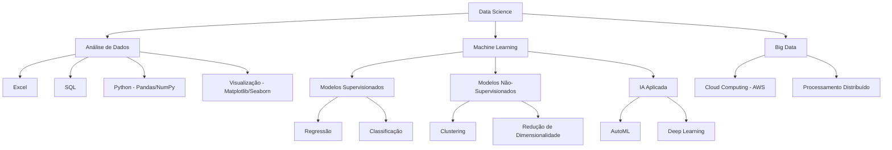

# DNC_DataScience

<div align="center">
  <h3>Repositório de Estudos e Projetos em Data Science</h3>
  <p><i>Materiais, exercícios e projetos desenvolvidos durante o curso da DNC</i></p>
</div>

<p align="center">
  <a href="#-visão-geral">Visão Geral</a> •
  <a href="#-estrutura-do-curso">Estrutura</a> •
  <a href="#-projetos-e-desafios">Projetos</a> •
  <a href="#-ferramentas">Ferramentas</a> •
  <a href="#-conteúdo">Conteúdo</a>
</p>

## 🔍 Visão Geral

Este repositório documenta minha jornada de aprendizado em Data Science através do curso da DNC, incluindo códigos, projetos práticos e materiais de estudo. O conteúdo reflete tanto a matriz curricular original quanto a atualizada, oferecendo uma visão completa das habilidades desenvolvidas.

<details>
<summary><b>🌟 Sobre a atualização curricular</b> (Clique para expandir)</summary>

> **Observação importante**: Este repositório está em processo de atualização para refletir a nova matriz curricular. Os materiais de ambas as versões (original e atualizada) serão disponibilizados na medida do possível.

### Por que essa atualização é importante?

1️⃣ **Conteúdo alinhado com o mercado**
- Módulos revisados para refletir tendências e exigências das empresas
- Foco em habilidades práticas valorizadas pelos empregadores

2️⃣ **Carga horária otimizada**
- Maior profundidade em Python, IA, Estatística e Machine Learning
- Distribuição de tempo baseada na relevância dos tópicos para o mercado atual

3️⃣ **Aprendizado prático e direcionado**
- Cases reais de empresas para aplicação imediata dos conhecimentos
- Materiais didáticos atualizados com as mais recentes ferramentas e técnicas
- Projetos que simulam desafios reais do dia a dia de um cientista de dados

</details>

## 📚 Estrutura do Curso

<details>
<summary><b>📋 Matriz Curricular Original</b> (Clique para expandir)</summary>

### Matéria 1: Introdução à Análise de Dados
- **Base de Dados** (4h)
- **Excel Intermediário** (8h)
- **Power BI** (8h)
- **Desafio 1** (3h)

### Matéria 2: Power BI
- **Carreira** (2h)
- **Excel Intermediário** (8h)
- **Desafio 2** (3h)

### Matéria 3: SQL para Análise de Dados
- **SQL para Análise de Dados** (8h)
- **Desafio 3** (3h)

### Matéria 4: Análise de Regressão em Python
- **Introdução ao Python** (12h)
- **Análise de Dados com Python** (6h)
- **CRISP-DM** (11h)
- **Desafio 4** (3h)

### Matéria 5: Extração e Tratamento em Python
- **Data Cleaning e Wrangling** (8h)
- **Desafio 5** (3h)

### Matéria 6: Modelos de Classificação
- **Regressão** (7h)
- **Classificação** (5h)
- **Desafio 6** (3h)

### Matéria 7: Modelos de Clusterização
- **Clustering** (7h)
- **Sistemas de Recomendação** (6h)
- **Big Data** (5h)
- **Modelos** (3h)
- **Desafio 7** (3h)
</details>

<details open>
<summary><b>🚀 Nova Matriz Curricular Atualizada</b> (Atual)</summary>

### Matéria 1: Introdução à Análise de Dados
- **Introdução a Dados** (2h): Conceitos fundamentais, estrutura e qualidade de dados
- **Base de Dados** (4h): Fundamentos de bancos de dados e estruturação de dados
- **Excel Intermediário** (8h): Funções avançadas, fórmulas, tabelas dinâmicas e visualizações
- **Desafio 1** (3h): Aplicação dos conhecimentos em problemas reais

### Matéria 2: Excel
- **Carreira** (2h): Perspectivas profissionais em análise de dados
- **Excel Intermediário** (8h): Funções avançadas e análise de dados
- **Desafio 2** (3h): Projeto prático com Excel

### Matéria 3: SQL para Análise de Dados
- **SQL para Análise de Dados** (8h): Consultas, junções e análises
- **Desafio 3** (3h): Projeto prático de análise com SQL

### Matéria 4: Análise de Dados em Python
- **Introdução ao Python** (9h): Configuração do ambiente, estruturação de código
- **Análise de Dados com Python** (6h): Uso avançado de Pandas, NumPy, Matplotlib e Seaborn
- **Estatística Descritiva** (5h): Organização, resumo e análise exploratória de dados
- **Estatística Inferencial** (8h): Amostragem, distribuições de probabilidade, testes de hipóteses
- **IA para análise de Dados** (2h): Automação com Python e SQL
- **Desafio 4** (3h): Projeto de análise de dados com Python

### Matéria 5: Extração e Tratamento em Python
- **Data Cleaning e Wrangling** (8h): Coleta, limpeza e integração de dados de múltiplas fontes
- **Introdução a ML** (2h): Fundamentos de aprendizado supervisionado e não supervisionado
- **Desafio 5** (3h): Projeto de tratamento de dados reais

### Matéria 6: Regressão e Classificação
- **Regressão** (8h): Implementação e avaliação de diferentes tipos de regressão
- **Classificação** (8h): Técnicas de classificação desde a coleta até a implementação
- **IA para ciência de Dados** (2h): IA para resolver problemas relacionados a modelos avançados
- **Desafio 6** (3h): Implementação de modelos de classificação e regressão

### Matéria 7: Modelos de Clusterização
- **Clustering** (7h): Técnicas de agrupamento não supervisionado
- **Big Data** (5h): Conceitos e ferramentas para grandes volumes de dados
- **Modelos com IA e Cloud** (6h): Implementação de modelos de ML utilizando AWS
- **Desafio 7** (3h): Projeto final de clusterização
</details>

<details>
<summary><b>✨ Módulos Novos</b> (Clique para expandir)</summary>

1. **Introdução a Dados** (2h)
   - Conceitos fundamentais e estrutura de dados
   - Qualidade de dados e ferramentas essenciais
   - Rotina dos profissionais de dados

2. **Estatística Descritiva** (5h)
   - Organização e resumo de dados
   - Análise exploratória com medidas estatísticas
   - Técnicas de visualização de dados

3. **Estatística Inferencial** (8h)
   - Seleção de amostras e distribuições de probabilidade
   - Intervalos de confiança e testes de hipóteses
   - Análise de relações entre variáveis

4. **IA para Análise de Dados** (2h)
   - Automação de análises com Python e SQL
   - Técnicas de IA aplicadas à análise de dados

5. **Introdução a ML** (2h)
   - Fundamentos de aprendizado supervisionado e não supervisionado
   - Preparação de dados para machine learning

6. **IA para Ciência de Dados** (2h)
   - Aplicações de IA para modelos avançados
   - Otimização de regressão e classificação com IA

7. **Modelos com IA e Cloud** (6h)
   - Implementação de modelos de ML na AWS
   - Desenvolvimento de pipelines escaláveis
   - Integração de IA e computação em nuvem
</details>

<details>
<summary><b>🔄 Módulos Regravados e Aprimorados</b> (Clique para expandir)</summary>

1. **Introdução a Python** (9h)
   - Configuração do ambiente de desenvolvimento
   - Estruturação de código e boas práticas
   - Manipulação de listas e variáveis compostas
   - Projetos práticos com Pandas e NumPy

2. **Análise de Dados com Python** (6h)
   - Uso avançado de Pandas e NumPy
   - Visualização com Matplotlib e Seaborn
   - Identificação de padrões em dados

3. **Data Cleaning e Wrangling** (8h)
   - Coleta e integração de dados de múltiplas fontes
   - Técnicas de limpeza e garantia de qualidade
   - Engenharia de features para modelagem preditiva
   - Otimização do fluxo de trabalho com grandes volumes

4. **Classificação** (8h)
   - Coleta e preparação de dados para classificação
   - Seleção, treinamento e ajuste de modelos
   - Validação e implementação de classificadores

5. **Regressão** (8h)
   - Regressão linear simples e múltipla
   - Otimização de hiperparâmetros
   - Avaliação e implementação de modelos de regressão
</details>

## 📊 Projetos e Desafios

<details open>
<summary><b>Visão Geral dos Desafios</b></summary>

O curso inclui 7 desafios práticos que aplicam os conceitos aprendidos em cada módulo, permitindo consolidar conhecimentos e desenvolver projetos para o portfólio.

| # | Desafio | Status | Tecnologias |
|---|---------|--------|-------------|
| 1 | Dashboard de E-commerce | ✅ Concluído | Power BI, DAX |
| 2 | Análise Avançada com Excel | ⏳ Não iniciado | Excel, Funções Avançadas |
| 3 | Consultas e Análises SQL | ⏳ Não iniciado | SQL, Banco de Dados |
| 4 | Análise Exploratória com Python | ⏳ Não iniciado | Python, Pandas, Matplotlib |
| 5 | Pipeline de Limpeza de Dados | ⏳ Não iniciado | Python, Pandas |
| 6 | Modelos de Classificação e Regressão | ⏳ Não iniciado | Scikit-learn, Python |
| 7 | Clusterização e Recomendação | ⏳ Não iniciado | Python, AWS, ML |

</details>

<details>
<summary><b>🔍 Desafio 1: Dashboard de E-commerce no Power BI</b> (Concluído ✅)</summary>

**Objetivo**: Criar um dashboard no Power BI para analisar os resultados de um e-commerce e prever tendências futuras.

**Descrição**: Neste desafio, desenvolvi um dashboard interativo no Power BI para analisar dados de vendas de um e-commerce. O arquivo RID190616_Desafio01.pbix contém a solução desenvolvida, que inclui:

1) **Análise de vendas por período**:
   - Visualização de tendências temporais
   - Comparação de desempenho entre diferentes períodos

2) **Segmentação de clientes**:
   - Análise por região geográfica
   - Categorização por comportamento de compra

3) **Performance de produtos**:
   - Identificação dos produtos mais vendidos
   - Análise de margens de lucro por categoria

4) **Indicadores de desempenho (KPIs)**:
   - Taxa de conversão
   - Ticket médio
   - Faturamento total

5) **Previsões futuras**:
   - Utilização de ferramentas de análise preditiva do Power BI
   - Projeção de vendas para os próximos períodos

**Habilidades desenvolvidas**:
- Importação e tratamento de dados no Power BI
- Criação de medidas e cálculos avançados com DAX
- Desenvolvimento de visualizações interativas
- Implementação de modelos preditivos simples
- Apresentação de insights de negócios
</details>

<details>
<summary><b>🔍 Desafios 2-7</b> (Clique para expandir)</summary>

### 🔍 Desafio 2: Análise avançada com Excel (⏳ Não iniciado)

**Objetivo**: Desenvolver análises complexas utilizando recursos avançados do Excel.

**Descrição**: Este desafio envolverá o uso de funções avançadas do Excel, como PROCV, SOMASE, tabelas dinâmicas, e ferramentas de análise estatística para extrair insights de conjuntos de dados empresariais.

### 🔍 Desafio 3: Consultas e análises com SQL (⏳ Não iniciado)

**Objetivo**: Criar consultas SQL para extrair informações relevantes de bancos de dados relacionais.

**Descrição**: Desenvolvimento de consultas SQL para resolver problemas de negócios, incluindo junções complexas, subconsultas, funções de agregação e análise de dados temporais.

### 🔍 Desafio 4: Análise exploratória com Python (⏳ Não iniciado)

**Objetivo**: Realizar uma análise exploratória completa utilizando Python e suas bibliotecas de análise de dados.

**Descrição**: Utilizando Pandas, NumPy, Matplotlib e Seaborn, exploração de um conjunto de dados, identificação de padrões, realização de testes estatísticos e apresentação de conclusões baseadas em dados.

### 🔍 Desafio 5: Limpeza e preparação de dados (⏳ Não iniciado)

**Objetivo**: Desenvolver um pipeline completo de limpeza e preparação de dados para análise.

**Descrição**: Foco nas técnicas de data cleaning e wrangling, incluindo tratamento de valores ausentes, detecção de outliers, normalização de dados e engenharia de features.

### 🔍 Desafio 6: Modelos de classificação e regressão (⏳ Não iniciado)

**Objetivo**: Implementar e avaliar modelos de classificação e regressão para resolver problemas de negócios.

**Descrição**: Desenvolvimento de modelos preditivos utilizando algoritmos de classificação e regressão, otimização de hiperparâmetros, avaliação do desempenho dos modelos e interpretação dos resultados.

### 🔍 Desafio 7: Clusterização e sistemas de recomendação (⏳ Não iniciado)

**Objetivo**: Criar modelos de clusterização e sistemas de recomendação utilizando técnicas avançadas de machine learning.

**Descrição**: Implementação de algoritmos de clusterização para segmentação de clientes e desenvolvimento de sistemas de recomendação baseados em conteúdo e filtragem colaborativa, além de exploração de conceitos de Big Data e implementação de modelos em ambientes de nuvem.
</details>

## 🛠️ Ferramentas e Tecnologias

<details open>
<summary><b>Stack Tecnológica</b></summary>

- **Excel**: Análise de dados básica e intermediária
- **Power BI**: Visualização e dashboards
- **SQL**: Consultas e análises em bancos de dados
- **Python**: Pandas, NumPy, Matplotlib, Scikit-learn
- **IA e ML**: Modelos supervisionados e não-supervisionados
- **Cloud**: AWS para implementação de modelos em produção
</details>

<details>
<summary><b>Diagrama de Tecnologias</b> (Clique para expandir)</summary>


</details>

## 📝 Conteúdo do Repositório

<details open>
<summary><b>Estrutura de Diretórios</b></summary>

```
DNC_DataScience/
├── Materia_1-Introducao_AnaliseDeDados/
│   ├── Aulas/
│   └── Desafio_1/
├── Materia_2-Excel/
│   ├── Aulas/
│   └── Desafio_2/
├── Materia_3-SQL/
│   ├── Aulas/
│   └── Desafio_3/
├── Materia_4-Python_Analise/
│   ├── Aulas/
│   └── Desafio_4/
├── Materia_5-Extracao_Tratamento/
│   ├── Aulas/
│   └── Desafio_5/
├── Materia_6-Regressao_Classificacao/
│   ├── Aulas/
│   └── Desafio_6/
├── Materia_7-Modelos_Clusterizacao/
│   ├── Aulas/
│   └── Desafio_7/
├── .gitignore
└── README.md
```
</details>

## 🔄 Atualizações

O repositório é atualizado regularmente com novos materiais e projetos conforme o avanço no curso. A nova estrutura curricular representa um aprimoramento significativo, com foco em tecnologias emergentes e demandas do mercado de trabalho.

<details>
<summary><b>📋 Log de Atualizações</b> (Clique para expandir)</summary>

- **Março/2025**: Atualização do README com nova estrutura dinâmica
- **Fevereiro/2025**: Conclusão do Desafio 1 - Dashboard de E-commerce
- **Janeiro/2025**: Início do curso e configuração do repositório
</details>

## 📫 Contato

Para dúvidas ou sugestões sobre este repositório, entre em contato através do GitHub.

---

<div align="center">
  <p><b>Nota</b>: Este repositório contém materiais de estudo do curso de Data Science da DNC e serve como portfólio de aprendizado e desenvolvimento de habilidades na área.</p>
</div>