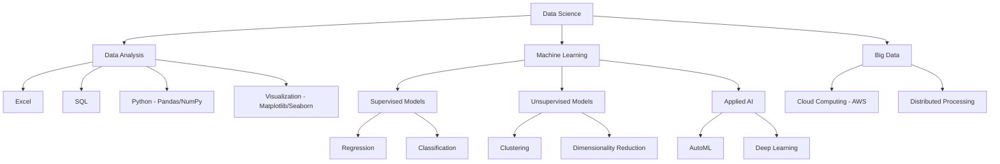

# DNC_DataScience

<div align="center">
  <h3>Data Science Studies and Projects Repository</h3>
  <p><i>Materials, exercises, and projects developed during the DNC course</i></p>
</div>

<p align="center">
  <a href="#-overview">Overview</a> •
  <a href="#-course-structure">Structure</a> •
  <a href="#-projects-and-challenges">Projects</a> •
  <a href="#-tools-and-technologies">Tools</a> •
  <a href="#-repository-content">Content</a> •
  <a href="#-license">License</a>
</p>

## 🔍 Overview

This repository documents my learning journey in Data Science through the DNC course, including code, practical projects, and study materials. The content reflects both the original and updated curriculum, offering a complete view of the skills developed.

<details>
<summary><b>🌟 About the curriculum update</b> (Click to expand)</summary>

> **Important note**: This repository is being updated to reflect the new curriculum. Materials from both versions (original and updated) will be made available as much as possible.

### Why is this update important?

1️⃣ **Market-aligned content**
- Modules completely revised to reflect industry trends and company requirements
- Focus on practical skills valued by employers

2️⃣ **Optimized course hours**
- Greater depth in Python, AI, Statistics, and Machine Learning
- Time distribution based on the relevance of topics in today's market

3️⃣ **Practical and targeted learning**
- Real company cases for immediate application of knowledge
- Updated teaching materials with the latest tools and techniques
- Projects that simulate real-world data scientist challenges
</details>

## 📚 Course Structure

<details>
<summary><b>📋 Original Curriculum</b> (Click to expand)</summary>

### Module 1: Introduction to Data Analysis
- **Database Fundamentals** (4h)
- **Intermediate Excel** (8h)
- **Power BI** (8h)
- **Challenge 1** (3h)

### Module 2: Power BI
- **Career Perspectives** (2h)
- **Intermediate Excel** (8h)
- **Challenge 2** (3h)

### Module 3: SQL for Data Analysis
- **SQL for Data Analysis** (8h)
- **Challenge 3** (3h)

### Module 4: Regression Analysis in Python
- **Introduction to Python** (12h)
- **Data Analysis with Python** (6h)
- **CRISP-DM** (11h)
- **Challenge 4** (3h)

### Module 5: Data Extraction and Processing in Python
- **Data Cleaning and Wrangling** (8h)
- **Challenge 5** (3h)

### Module 6: Classification Models
- **Regression** (7h)
- **Classification** (5h)
- **Challenge 6** (3h)

### Module 7: Clustering Models
- **Clustering** (7h)
- **Recommendation Systems** (6h)
- **Big Data** (5h)
- **Models** (3h)
- **Challenge 7** (3h)
</details>

<details>
<summary><b>🚀 Updated Curriculum</b> (Click to expand)</summary>

### Module 1: Introduction to Data Analysis
- **Introduction to Data** (2h): Fundamental concepts, data structure, and quality
- **Database Fundamentals** (4h): Database foundations and data structuring
- **Intermediate Excel** (8h): Advanced functions, formulas, pivot tables, and visualizations
- **Challenge 1** (3h): Applying knowledge to real-world problems

### Module 2: Excel
- **Career Perspectives** (2h): Professional opportunities in data analysis
- **Intermediate Excel** (8h): Advanced functions and data analysis
- **Challenge 2** (3h): Practical Excel project

### Module 3: SQL for Data Analysis
- **SQL for Data Analysis** (8h): Queries, joins, and analysis
- **Challenge 3** (3h): Practical SQL analysis project

### Module 4: Data Analysis in Python
- **Introduction to Python** (9h): Environment setup, code structuring
- **Data Analysis with Python** (6h): Advanced use of Pandas, NumPy, Matplotlib, and Seaborn
- **Descriptive Statistics** (5h): Data organization, summarization, and exploratory analysis
- **Inferential Statistics** (8h): Sampling, probability distributions, hypothesis testing
- **AI for Data Analysis** (2h): Automation with Python and SQL
- **Challenge 4** (3h): Python data analysis project

### Module 5: Data Extraction and Processing in Python
- **Data Cleaning and Wrangling** (8h): Collection, cleaning, and integration of data from multiple sources
- **Introduction to ML** (2h): Fundamentals of supervised and unsupervised learning
- **Challenge 5** (3h): Real data processing project

### Module 6: Regression and Classification
- **Regression** (8h): Implementation and evaluation of different regression types
- **Classification** (8h): Classification techniques from data collection to implementation
- **AI for Data Science** (2h): AI solutions for advanced model-related problems
- **Challenge 6** (3h): Implementation of classification and regression models

### Module 7: Clustering Models
- **Clustering** (7h): Unsupervised grouping techniques
- **Big Data** (5h): Concepts and tools for large data volumes
- **Models with AI and Cloud** (6h): Implementation of ML models using AWS
- **Challenge 7** (3h): Final clustering project
</details>

<details>
<summary><b>✨ New Modules</b> (Click to expand)</summary>

1. **Introduction to Data** (2h)
   - Fundamental concepts and data structure
   - Data quality and essential tools
   - Data professionals' routine

2. **Descriptive Statistics** (5h)
   - Data organization and summarization
   - Exploratory analysis with statistical measures
   - Data visualization techniques

3. **Inferential Statistics** (8h)
   - Sample selection and probability distributions
   - Confidence intervals and hypothesis testing
   - Analysis of relationships between variables

4. **AI for Data Analysis** (2h)
   - Analysis automation with Python and SQL
   - AI techniques applied to data analysis

5. **Introduction to ML** (2h)
   - Fundamentals of supervised and unsupervised learning
   - Data preparation for machine learning

6. **AI for Data Science** (2h)
   - AI applications for advanced models
   - Optimization of regression and classification with AI

7. **Models with AI and Cloud** (6h)
   - Implementation of ML models in AWS
   - Development of scalable pipelines
   - Integration of AI and cloud computing
</details>

<details>
<summary><b>🔄 Revised and Enhanced Modules</b> (Click to expand)</summary>

1. **Introduction to Python** (9h)
   - Development environment setup
   - Code structuring and best practices
   - List manipulation and composite variables
   - Practical projects with Pandas and NumPy

2. **Data Analysis with Python** (6h)
   - Advanced use of Pandas and NumPy
   - Visualization with Matplotlib and Seaborn
   - Pattern identification in data

3. **Data Cleaning and Wrangling** (8h)
   - Collection and integration of data from multiple sources
   - Cleaning techniques and quality assurance
   - Feature engineering for predictive modeling
   - Workflow optimization with large volumes

4. **Classification** (8h)
   - Data collection and preparation for classification
   - Model selection, training, and tuning
   - Classifier validation and implementation

5. **Regression** (8h)
   - Simple and multiple linear regression
   - Hyperparameter optimization
   - Evaluation and implementation of regression models
</details>

## 📊 Projects and Challenges

<details open>
<summary><b>Challenges Overview</b></summary>

The course includes 7 practical challenges that apply concepts learned in each module, allowing students to consolidate knowledge and develop portfolio projects.

| # | Challenge | Status | Technologies |
|---|---------|--------|-------------|
| 1 | E-commerce Dashboard | ✅ Completed | Power BI, DAX |
| 2 | Advanced Excel Analysis | ⏳ Not started | Excel, Advanced Functions |
| 3 | SQL Queries and Analysis | ⏳ Not started | SQL, Databases |
| 4 | Exploratory Analysis with Python | ⏳ Not started | Python, Pandas, Matplotlib |
| 5 | Data Cleaning Pipeline | ⏳ Not started | Python, Pandas |
| 6 | Classification and Regression Models | ⏳ Not started | Scikit-learn, Python |
| 7 | Clustering and Recommendation | ⏳ Not started | Python, AWS, ML |

</details>

<details>
<summary><b>🔍 Challenge 1: E-commerce Dashboard in Power BI</b> (Completed ✅)</summary>

**Objective**: Create a Power BI dashboard to analyze e-commerce results and predict future trends.

**Description**: In this challenge, I developed an interactive Power BI dashboard to analyze e-commerce sales data. The RID190616_Desafio01.pbix file contains the developed solution, which includes:

1) **Sales analysis by period**:
   - Visualization of temporal trends
   - Performance comparison between different periods

2) **Customer segmentation**:
   - Analysis by geographic region
   - Categorization by purchasing behavior

3) **Product performance**:
   - Identification of best-selling products
   - Profit margin analysis by category

4) **Key Performance Indicators (KPIs)**:
   - Conversion rate
   - Average ticket
   - Total revenue

5) **Future forecasts**:
   - Use of Power BI predictive analysis tools
   - Sales projection for upcoming periods

**Skills developed**:
- Data import and processing in Power BI
- Creation of measures and advanced calculations with DAX
- Development of interactive visualizations
- Implementation of simple predictive models
- Presentation of business insights
</details>

<details>
<summary><b>🔍 Challenges 2-7</b> (Click to expand)</summary>

### 🔍 Challenge 2: Advanced Analysis with Excel (⏳ Not started)

**Objective**: Develop complex analyses using advanced Excel features.

**Description**: This challenge will involve using advanced Excel functions such as VLOOKUP, SUMIF, pivot tables, and statistical analysis tools to extract insights from business datasets.

### 🔍 Challenge 3: SQL Queries and Analysis (⏳ Not started)

**Objective**: Create SQL queries to extract relevant information from relational databases.

**Description**: Development of SQL queries to solve business problems, including complex joins, subqueries, aggregation functions, and temporal data analysis.

### 🔍 Challenge 4: Exploratory Analysis with Python (⏳ Not started)

**Objective**: Conduct a complete exploratory analysis using Python and its data analysis libraries.

**Description**: Using Pandas, NumPy, Matplotlib, and Seaborn to explore a dataset, identify patterns, perform statistical tests, and present data-driven conclusions.

### 🔍 Challenge 5: Data Cleaning and Preparation (⏳ Not started)

**Objective**: Develop a complete data cleaning and preparation pipeline for analysis.

**Description**: Focus on data cleaning and wrangling techniques, including handling missing values, outlier detection, data normalization, and feature engineering.

### 🔍 Challenge 6: Classification and Regression Models (⏳ Not started)

**Objective**: Implement and evaluate classification and regression models to solve business problems.

**Description**: Development of predictive models using classification and regression algorithms, hyperparameter optimization, model performance evaluation, and results interpretation.

### 🔍 Challenge 7: Clustering and Recommendation Systems (⏳ Not started)

**Objective**: Create clustering models and recommendation systems using advanced machine learning techniques.

**Description**: Implementation of clustering algorithms for customer segmentation and development of content-based and collaborative filtering recommendation systems, plus exploration of Big Data concepts and model implementation in cloud environments.
</details>

## 🛠️ Tools and Technologies

<details open>
<summary><b>Technology Stack</b></summary>

- **Excel**: Basic and intermediate data analysis
- **Power BI**: Visualization and dashboards
- **SQL**: Database queries and analysis
- **Python**: Pandas, NumPy, Matplotlib, Scikit-learn
- **AI and ML**: Supervised and unsupervised models
- **Cloud**: AWS for production model implementation
</details>

<details>
<summary><b>Technology Diagram</b> (Click to expand)</summary>


</details>

## 📝 Repository Content

<details open>
<summary><b>Directory Structure</b></summary>

```
DNC_DataScience/
├── Desafios/
│   └── Módulo 01/
│       └── Desafio/
├── Materia_1-Introducao_AnaliseDeDados/
│   └── Aulas/
├── Materia_2-PowerBi/
│   └── Aulas/
├── Materia_3-SQL/
│   └── Aulas/
├── Materia_4-Python_Analise/
│   └── Aulas/
├── Materia_5-Extracao_Tratamento/
│   └── Aulas/
├── Materia_6-Regressao_Classificacao/
│   └── Aulas/
├── Materia_7-Modelos_Clusterizacao/
│   └── Aulas/
├── .gitignore
├── LICENSE.md
└── README.md

```
</details>

## 🔄 Updates

This repository is regularly updated with new materials and projects as I progress through the course. The new curriculum structure represents a significant enhancement, focusing on emerging technologies and job market demands.

<details>
<summary><b>📋 Update Log</b> (Click to expand)</summary>

- **March/2025**: README update with new dynamic structure
- **February/2025**: Completion of Challenge 1 - E-commerce Dashboard
- **January/2025**: Course start and repository setup
</details>

## 📜 License

<details open>
<summary><b>CC BY-NC-ND 4.0 License</b></summary>

This repository is licensed under the [Creative Commons Attribution-NonCommercial-NoDerivatives 4.0 International License](https://creativecommons.org/licenses/by-nc-nd/4.0/).

### What this means:

- ✅ **You can share** — You are free to copy and redistribute the material in any medium or format
- ❌ **No commercial use** — You may not use the material for commercial purposes
- ❌ **No derivatives** — You may not remix, transform, or build upon the material
- ✅ **Attribution required** — You must give appropriate credit, provide a link to the license, and indicate if changes were made

For the complete license terms, please see the [LICENSE.md](LICENSE.md) file.
</details>

## 📫 Contact

For questions or suggestions about this repository, please contact me through GitHub.

---

<div align="center">
  <p><b>Note</b>: This repository contains study materials from the DNC Data Science course and serves as a portfolio for learning and skill development in the field.</p>
</div>
